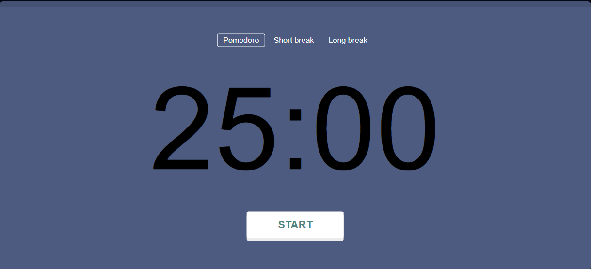

# Pomodoro Project

This is a Pomodoro Timer project built using JavaScript with DOM manipulation. The Pomodoro Technique is a time management method that uses a timer to break work into intervals, traditionally 25 minutes in length, separated by short breaks.

## Features

- Set customizable work and break durations.
- Sound notification and browser notification when a timer interval ends.
- Start and pause the timer.
- Background indicators for different timer states.
- Progress bar to visualize the remaining time.

## Tech Stack

- JavaScript
- HTML
- CSS

## Usage

1. Clone the repository:
git clone https://github.com/yuliussetyawan/pomodoro-timer.git

2. Open `index.html` in your web browser.

3. Click the "Start" button to begin the Pomodoro timer.

## Credits

This project is based on the [Pomodoro Timer tutorial](https://freshman.tech/pomodoro-timer/) by Freshman.tech. I would like to express my gratitude for their valuable resource.

## Contributing

Contributions are welcome! If you have any ideas, suggestions, or bug reports, please create an issue or submit a pull request.

**Note:** The Pomodoro Technique is a time management method developed by Francesco Cirillo. You can learn more about it at [pomofocus.io](https://pomofocus.io) and [cirillocompany.de/pages/pomodoro-technique](https://cirillocompany.de/pages/pomodoro-technique).
